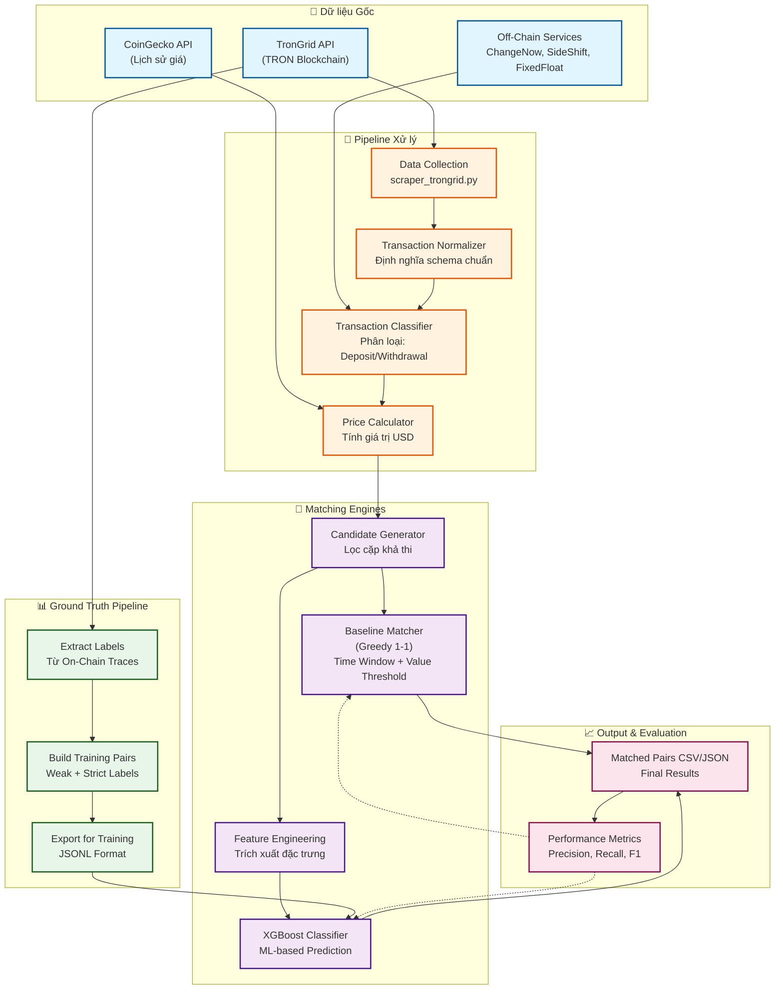
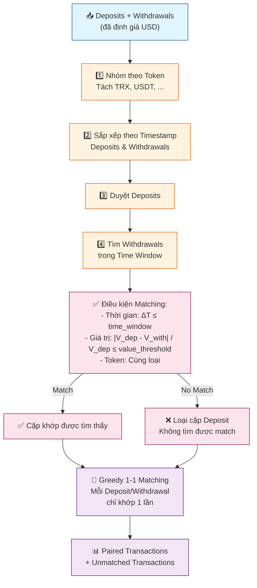
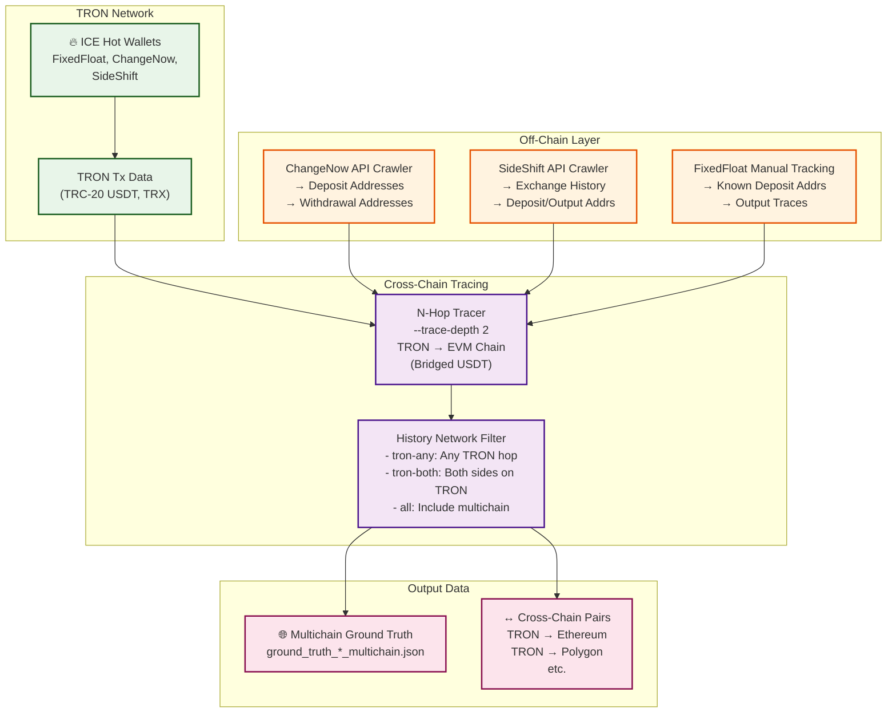
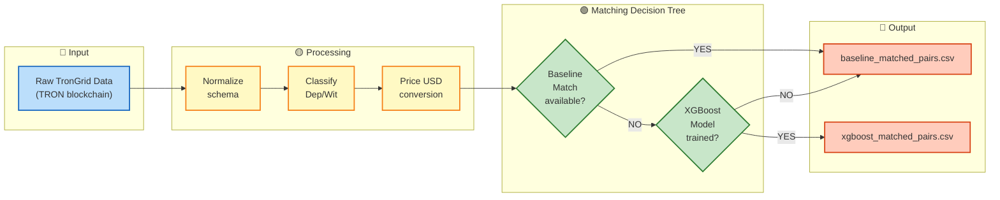

# TRON-ICE: Sơ đồ hệ thống và kiến trúc

## 1. Sơ đồ Kiến trúc Tổng thể



---

## 2. Chi tiết Luồng Matching Baseline



**Tham số chính:**
- `time_window` (default: 300s) - Cửa sổ thời gian tối đa giữa nạp-rút
- `value_threshold` (default: 0.05 = 5%) - Sai số giá trị tối đa
- `bucket_minutes` (default: 5) - Độ rộng bucket để mapping thời gian→giá

---

## 3. Chi tiết Pipeline XGBoost

```mermaid
graph LR
    subgraph "Phase 1: Chuẩn bị Dữ liệu"
        A["📥 Load Deposits<br/>+ Withdrawals<br/>(priced)"]
    end

    subgraph "Phase 2: Sinh Ứng viên"
        B["Candidate Generator<br/>generate_candidates<br/>- Time: ΔT ≤ 600s<br/>- Relative Value: ≤ 15%<br/>- Token: Same"]
        C["📊 Candidate Pool<br/>~100K - 1M pairs"]
    end

    subgraph "Phase 3: Trích Đặc trưng"
        D["Feature Engineering<br/>extract_features<br/>- Time diff<br/>- Value diff %<br/>- Price volatility<br/>- Frequency patterns"]
        E["🔢 Feature Matrix X<br/>Shape: N × D<br/>D ≈ 20-50 features"]
    end

    subgraph "Phase 4: Huấn luyện"
        F["📚 Ground Truth Labels<br/>y ∈ {0, 1}"]
        G["XGBoost Classifier<br/>- n_estimators: 100-500<br/>- max_depth: 4-8<br/>- learning_rate: 0.01-0.1"]
        H["🎓 Trained Model<br/>models/xgboost_*.pkl"]
    end

    subgraph "Phase 5: Dự đoán"
        I["Predict Probabilities<br/>predict_proba"]
        J["🎲 Prob. Scores<br/>p_match ∈ [0, 1]"]
    end

    subgraph "Phase 6: Ghép Cặp"
        K["Greedy Matcher<br/>- Sort by score ↓<br/>- 1-1 matching<br/>- Threshold: default 0.5"]
        L["✅ Final Matched Pairs"]
    end

    A --> B
    B --> C
    C --> D
    D --> E
    E --> G
    F --> G
    G --> H
    H --> I
    I --> J
    J --> K
    K --> L

    classDef phase1 fill:#e1f5ff,stroke:#01579b,stroke-width:2px
    classDef phase2 fill:#fff3e0,stroke:#e65100,stroke-width:2px
    classDef phase3 fill:#f3e5f5,stroke:#4a148c,stroke-width:2px
    classDef phase4 fill:#e8f5e9,stroke:#1b5e20,stroke-width:2px
    classDef phase5 fill:#fce4ec,stroke:#880e4f,stroke-width:2px

    class A phase1
    class B,C phase2
    class D,E phase3
    class F,G,H phase4
    class I,J phase5
    class K,L phase1
```



---

## 4. Kiến trúc Liên chuỗi (Cross-Chain Tracing)



**Các chế độ Trace:**
- `trace-depth 0`: Không trace (chỉ TRON)
- `trace-depth 1`: Trace 1 hop (TRON → EVM)
- `trace-depth 2`: Trace 2 hops (TRON → EVM → EVM)

---

## 5. Luồng Dữ liệu Chi tiết (Data Flow)



---

## 6. Bảng So sánh: Baseline vs XGBoost

| Tiêu chí | Baseline Matcher | XGBoost Matcher |
|---------|-----------------|-----------------|
| **Thuật toán** | Greedy 1-1 heuristic | ML-based classification |
| **Đặc trưng** | Time + Value + Token | 20-50 engineered features |
| **Huấn luyện** | Không cần training | Cần ground truth labels |
| **Tốc độ** | ⚡ Rất nhanh (ms) | 🐢 Chậm hơn (s) |
| **Độ chính xác** | 📊 ~70-80% | 📊 ~85-95% |
| **Tham số** | `time_window`, `value_threshold` | Hyperparameters XGBoost |
| **Sử dụng** | Nhanh chóng, PoC, baseline | Production, high-accuracy |
| **Lợi ích** | Đơn giản, không cần label | Cao hơn, linh hoạt hơn |
| **Hạn chế** | Cứng nhắc, kém linh hoạt | Cần dữ liệu training chất lượng |

---

## 7. Sơ đồ Chu kỳ Phát triển (Development Cycle)

```mermaid
graph TB
    Start["🚀 Bắt đầu:<br/>Service + Year"]
    Step1["1️⃣ Thu thập dữ liệu<br/>scraper_trongrid.py"]
    Step2["2️⃣ Chuẩn hóa + Phân loại<br/>normalizer + classifier"]
    Step3["3️⃣ Định giá USD<br/>price_calculator.py"]
    Step4["4️⃣ Sinh Ground Truth<br/>run_ground_truth.py"]
    Step5["5️⃣ Xây dựng Training Pairs<br/>build_weak_training_pairs.py"]
    Step6["6️⃣ Huấn luyện XGBoost<br/>train_xgboost.py"]
    Step7["7️⃣ Dự đoán + Ghép cặp<br/>predict_xgboost.py"]
    Step8["8️⃣ Đánh giá kết quả<br/>Metrics: Precision, Recall"]
    Decision{"Độ chính xác<br/>đạt yêu cầu?"}
    Tuning["🔧 Điều chỉnh:<br/>- Hyperparameters<br/>- Feature engineering<br/>- Training data"]
    End["✅ Hoàn thành<br/>Matched pairs output"]

    Start --> Step1
    Step1 --> Step2
    Step2 --> Step3
    Step3 --> Step4
    Step4 --> Step5
    Step5 --> Step6
    Step6 --> Step7
    Step7 --> Step8
    Step8 --> Decision
    Decision -->|Không| Tuning
    Tuning --> Step5
    Decision -->|Có| End

    classDef step fill:#e3f2fd,stroke:#1565c0,stroke-width:2px
    classDef decision fill:#fff9c4,stroke:#f57f17,stroke-width:2px
    classDef end fill:#c8e6c9,stroke:#2e7d32,stroke-width:2px

    class Step1,Step2,Step3,Step4,Step5,Step6,Step7,Step8 step
    class Decision decision
    class Start,End end
```

---

## 8. Cấu trúc Dữ liệu CSV/JSON

### Deposit/Withdrawal CSV
```csv
tx_hash,from_address,to_address,token,amount,timestamp,block_number,transaction_fee,usd_value
0x123...,TCN7x...,TJLL...,USDT,1000.00,2024-01-15 10:30:45,50000000,1.0,1000.00
```

### Matched Pairs JSON
```json
{
  "deposit_tx": {
    "tx_hash": "0xabc...",
    "timestamp": "2024-01-15 10:30:45",
    "amount": 1000.00,
    "usd_value": 1000.00
  },
  "withdrawal_tx": {
    "tx_hash": "0xdef...",
    "timestamp": "2024-01-15 10:35:12",
    "amount": 999.50,
    "usd_value": 999.50
  },
  "time_diff": 267,
  "value_diff_pct": 0.05,
  "match_method": "baseline",
  "confidence_score": 0.92
}
```

### Ground Truth JSONL
```json
{"dep_tx": "0xabc...", "wit_tx": "0xdef...", "label": 1, "weight": 1.0}
{"dep_tx": "0x123...", "wit_tx": "0x456...", "label": 0, "weight": 0.5}
```

---

## 9. Lệnh Chạy Hệ thống

```bash
# 1. Thu thập dữ liệu cho một ICE service
python main.py --service fixedfloat --year 2025 --mode data_collection

# 2. Chạy baseline matching
python main.py --service fixedfloat --year 2025 --mode baseline_algorithm

# 3. Tạo ground truth và huấn luyện XGBoost
python ground-truth/run_full_pipeline.py --service sideshift --year 2026 --trace-depth 2

# 4. Dự đoán XGBoost trên dữ liệu mới
python ground-truth/predict_xgboost.py --service fixedfloat --year 2025

# 5. Chạy toàn bộ pipeline
python main.py --service changenow --year 2025 --mode full \
  --time_window 300 --value_threshold 0.05
```

---

## 10. Tóm tắt Kiến trúc

- **Matching Engines:** 2 phương pháp (Baseline heuristic + XGBoost ML)
- **Data Flow:** TronGrid → Normalize → Classify → Price → Match → Output
- **Cross-Chain Support:** Optional N-hop tracing (TRON ↔ EVM chains)
- **Training Pipeline:** Ground truth generation → XGBoost training → Inference
- **Services Supported:** FixedFloat, ChangeNow, SideShift
