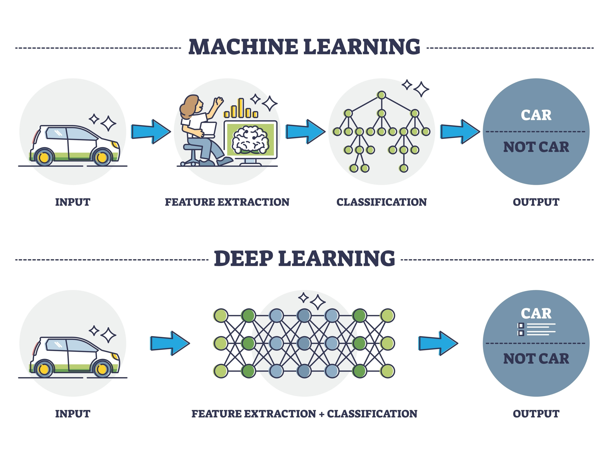

Tuyệt vời! Việc chọn **Hướng 1 (Sử dụng XGBoost)** hoàn toàn trùng khớp và bám sát vào tên bài báo mà nhóm bạn đã định hình trong file `NT547_G13.pdf`: *"TRON-ICE: Machine Learning-Enhanced Transaction Matching..."*. Đây là một hướng đi mang tính học thuật cao và chắc chắn sẽ ghi điểm tốt.

Vì XGBoost là một thuật toán Học có giám sát (Supervised Learning), điểm mấu chốt để thành công không chỉ nằm ở code, mà nằm ở **Dữ liệu đặc trưng (Features)** và **Nhãn (Labels)**. 

Dưới đây là action-plan chi tiết cho Hướng 1 dành cho hai bạn trong Giai đoạn 3:

### 1. Nhiệm vụ của Sinh viên A (Main Dev - Triển khai Code)

Chạy lại thuật toán cũ với dữ liệu mẫu 


Phát triển thuật toán mới với XGBoost, bạn không cần tự code lại thuật toán từ đầu mà sẽ sử dụng thư viện `xgboost` trong Python. Trọng tâm của bạn là **Feature Engineering (Trích xuất đặc trưng)**. 


*Hình 1: Mẫu work flow không đúng hoàn toàn*


**Bước 1: Xây dựng Vector Đặc trưng (Feature Vector)**
Thay vì dùng IF-ELSE, bạn phải biến mỗi cặp giao dịch (1 Nạp - 1 Rút) thành một tập hợp các con số để đưa vào mô hình. Các features quan trọng cần trích xuất:
* `delta_T` (Độ lệch thời gian): Thời gian giao dịch rút trừ đi thời gian giao dịch nạp.
* `delta_V_ratio` (Tỉ lệ lệch giá trị): $|V_{in} - V_{out}| / V_{in}$. *(Nhớ lưu ý từ file note: mạng Tron tính phí bằng Energy/Bandwidth nên luôn có độ lệch nhỏ từ 1-5%, đừng bắt bằng 0 tuyệt đối).*
* `time_decay_weight`: Trọng số thời gian (ví dụ: $e^{-\lambda \cdot \Delta T}$). Giao dịch nạp/rút càng gần nhau, trọng số càng cao.
* `token_type_match`: Bằng 1 nếu cùng loại token (USDT -> USDT), bằng 0 nếu khác loại (TRX -> USDT).

**Bước 2: Viết Code Huấn luyện (Training Pipeline)**
Bạn có thể tham khảo luồng logic cơ bản sau để bắt tay vào code:
```python
import xgboost as xgb
from sklearn.model_selection import train_test_split
from sklearn.metrics import precision_score, recall_score, f1_score

# X: Ma trận chứa các features (delta_T, delta_V_ratio,...) của các cặp Nạp-Rút
# y: Nhãn (1 là cặp khớp/rửa tiền thật, 0 là không khớp)
X_train, X_test, y_train, y_test = train_test_split(X, y, test_size=0.2, random_state=42)

# Khởi tạo mô hình XGBoost
model = xgb.XGBClassifier(
    max_depth=5,
    learning_rate=0.1,
    n_estimators=100,
    objective='binary:logistic'
)

# Huấn luyện
model.fit(X_train, y_train)

# Đánh giá (Ablation/Evaluation)
y_pred = model.predict(X_test)
print("F1-Score:", f1_score(y_test, y_pred))
```


### 2. Nhiệm vụ của Sinh viên B (Main Research - Ground-truth & Viết lách)

Main Dev (A) không thể chạy được đoạn code trên nếu biến `y` (Nhãn/Ground-truth) không tồn tại. Việc của B lúc này cực kỳ quan trọng:

**Bước 1: Tạo tập dữ liệu Ground-Truth (Gán nhãn)**
XGBoost cần học từ các ví dụ "đúng". Bạn phải tạo ra một tập dữ liệu chuẩn:
* **Positive samples (Nhãn = 1):** Tìm kiếm hoặc giả lập các cặp giao dịch mà bạn chắc chắn 100% là của cùng một người (ví dụ: tự thực hiện 10-20 giao dịch nạp rút qua ChangeNOW trên Tron để lấy hash làm mẫu, hoặc dùng các luật heuristics cực kỳ khắt khe để lọc ra tập chắc chắn đúng).
* **Negative samples (Nhãn = 0):** Ghép ngẫu nhiên các giao dịch nạp và rút không liên quan với nhau.

**Bước 2: Viết mục 4.3 (Thuật toán đề xuất) vào Overleaf**
* Trình bày phương trình toán học của các Features (như `time_decay_weight` tính bằng công thức gì).
* Giải thích lý do chọn XGBoost thay vì Random Forest hay SVM (ví dụ: XGBoost xử lý tốt dữ liệu mất cân bằng - imbalanced data, và chống overfitting tốt).
* Ghi rõ các siêu tham số (hyperparameters) đã dùng như `max_depth`, `learning_rate` để đảm bảo tính tái tạo (Reproducibility).

**Sự phối hợp:** B chuẩn bị file CSV chứa các cột dữ liệu (gồm features và label) -> A đọc file CSV đó bằng `pandas`, ném vào `xgboost` để train -> A xuất kết quả F1-Score -> B lấy kết quả đó vẽ biểu đồ và cho vào mục Evaluation của bài báo.